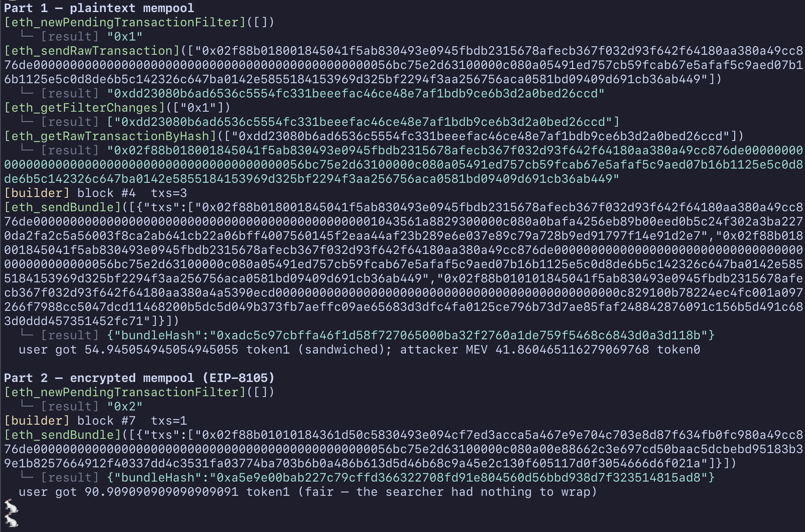

# zeth-sandwich

Sandwich vs encrypted mempool, end-to-end against zeth's own JSON-RPC.

`./demo.sh` builds zeth (`-Ddev=true`), boots `zeth node --dev -v`, deploys a
constant-product AMM, and drives a victim + searcher with `cast`:

- **Part 1 — plaintext mempool:** the victim broadcasts a swap to the public pool; the
  searcher sees it (`eth_newPendingTransactionFilter` → `eth_getRawTransactionByHash`)
  and wraps `[front, victim, back]` into `eth_sendBundle` → the victim is sandwiched.
- **Part 2 — encrypted / private mempool:** the victim sends the swap as a private
  bundle; the searcher's filter sees nothing → fair fill.

`zeth node -v` prints the orderflow trace as `[method](params) ← [result]` (use `-vvvv`
for every RPC). The dev-only RPC (`eth_sendBundle` instamine, `evm_mine`) is compiled in
only with `-Ddev=true`; a production binary omits it.



```sh
cd examples/zeth-sandwich && ./demo.sh
```
